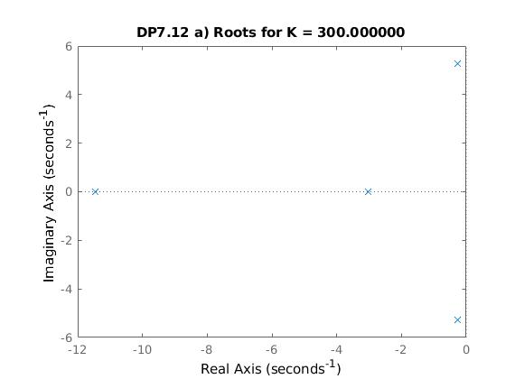

# Systems_and_Control

The purpose of this repository is to store MATLAB files and outputs for UBC ELEC 341: Systems and Control course work.

## Highlight 1

Selecting gain values using Root-Locus plot and pole-zero positions, and then comparing step responses for various gain values. Note the difference in response time, stability, oscillation frequency, etc. between the step responses.

## Highlight 2

Change in Root-Locus plot for varying values of alpha.

## Highlight 3

Comparing resilience to disturbances for various gain values and inputs.

